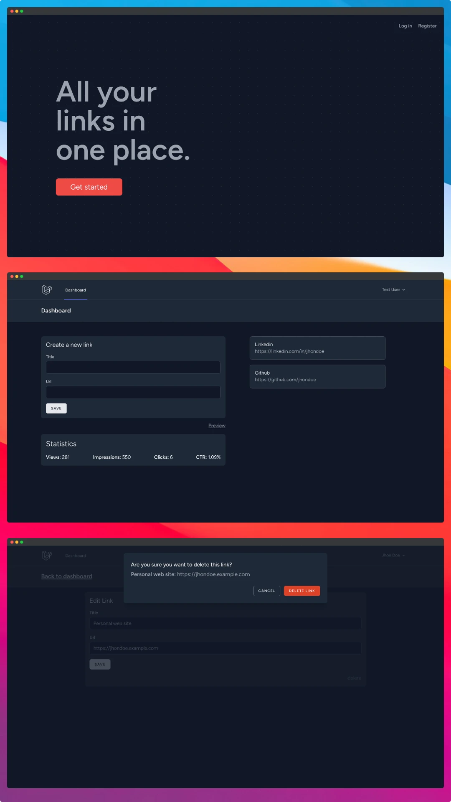

# Linktree clone
A pretty simple linktree clone made with Laravel and tailwindcss.

## features
- Responsive, dark theme and light theme
- Create and edit links

## Preview

## Installation
1. Clone the repository
2. Run `composer install`
3. Run `npm install && npm run dev`
4. Copy `.env.example` to `.env`
5. Run `php artisan key:generate`
6. Fill in the database credentials in the `.env` file
7. Run `php artisan migrate --seed`
8. Run `php artisan serve` to start the development server
9. Visit `localhost:8000` in your browser

## Contributing
Thank you for your interest in contributing to Linktree clone! We welcome all contributions, big and small.

[contributing.md](CONTRIBUTING.md)

## Author
Github: [migueweb](https://github.com/migueweb)
