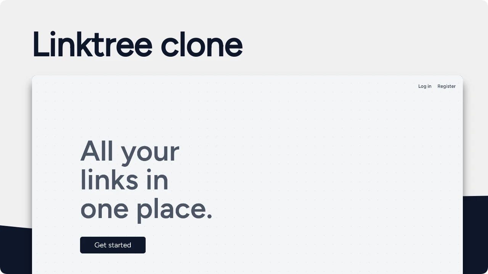

<!-- badges -->

# Linktree clone

A pretty simple linktree clone made with Laravel and tailwindcss. Create and manage your links in one place.

## Features

-   Profile bio, username
-   Create and edit links
-   Statistics clicks, impressions, views, ctr
-   Responsive, dark theme and light theme

## Installation

### Requirements

-   [PHP](https://www.php.net/manual/en/install)
-   [Composer](https://getcomposer.org/)
-   [NPM](https://nodejs.org/en/download)

1. Clone the repository
2. Run `composer install`
3. Run `npm install && npm run dev`
4. Run `cp .env.example .env`
5. Run `php artisan key:generate`
6. Fill in the database credentials in the `.env` file
7. Run `php artisan migrate --seed`
8. Run `php artisan serve` to start the development server
9. Visit `localhost:8000` in your browser

## 🤝 Contributing

Thank you for your interest in contributing to Linktree clone! We welcome all contributions, big and small. for more deatils see [contributing.md](CONTRIBUTING.md)

## Author

Github: [migueweb](https://github.com/migueweb)
